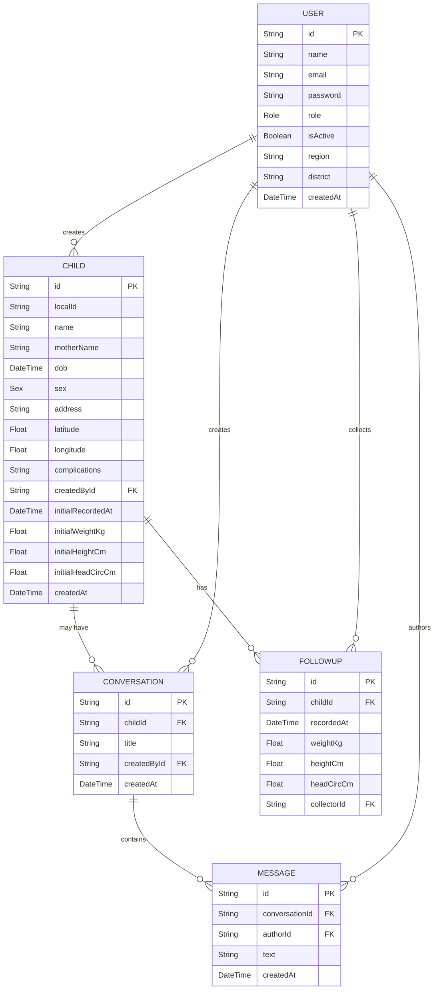

**Entity Relationship Diagram (ERD)**

This file contains a Mermaid ER diagram for the NutriMap backend data model (derived from `prisma/schema.prisma`). You can preview this in VS Code with a Mermaid extension or paste the diagram into https://mermaid.live to render an image.

**Notes**
- `User` has roles: `admin`, `chw`, `nutritionist`. Role controls access in middleware.
- `Child` records belong to a `User` (creator) via `createdById` and can have many `FollowUp` records.
- `Conversation` optionally links to a `Child` and contains `Message` entries authored by `User`.
- `FollowUp` points to `Child` and to the collecting `User` as `collectorId`.

How to render
- In VS Code: install a Mermaid preview extension, open `docs/ERD.md` and toggle preview.
- Online: paste the Mermaid block into https://mermaid.live to export PNG/SVG.
